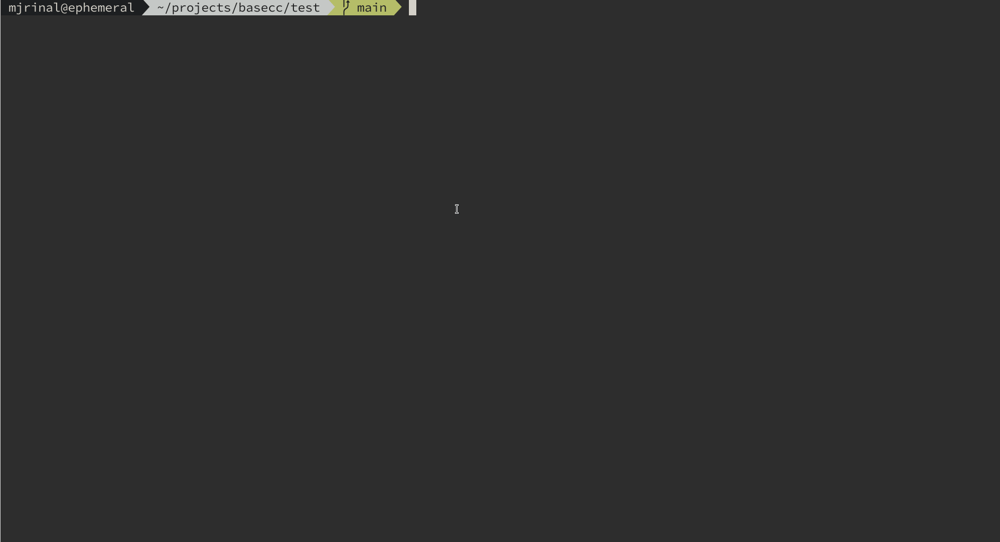

# basecc : Binary Automatic SECComp Rule Generation

*basecc* is a tool that can automatically determine the system calls made in a given binary and create a custom seccomp filter to only allow the system calls that should be made during execution.

## How it Works

basecc uses Binary Ninja's MLIL to find which system calls are used in a binary. For dynamically linked binaries with imported functions, the plugin can process libraries and determine which system calls are made within exported functions. This mapping of functions to system calls can then be used for further processing of binaries that use the library. The tool creates a shared object file which can be [LD_PRELOAD'd](https://man7.org/linux/man-pages/man8/ld.so.8.html) and initialize the seccomp rules for the specific binary.

	

